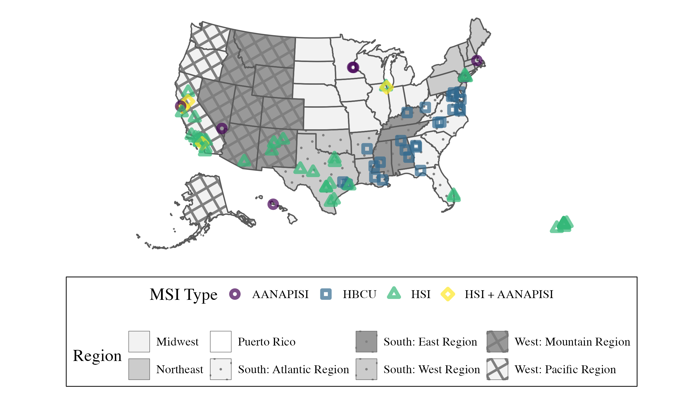
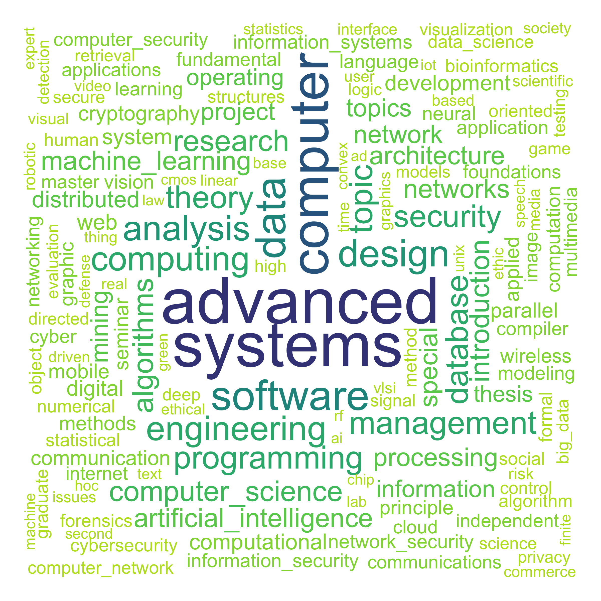
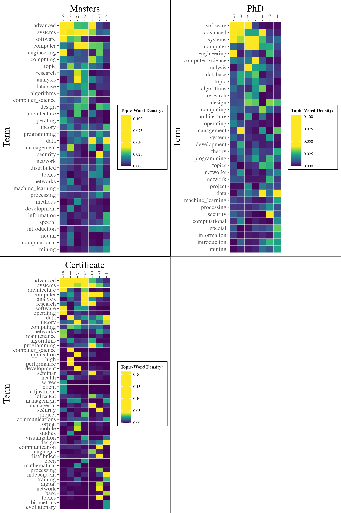
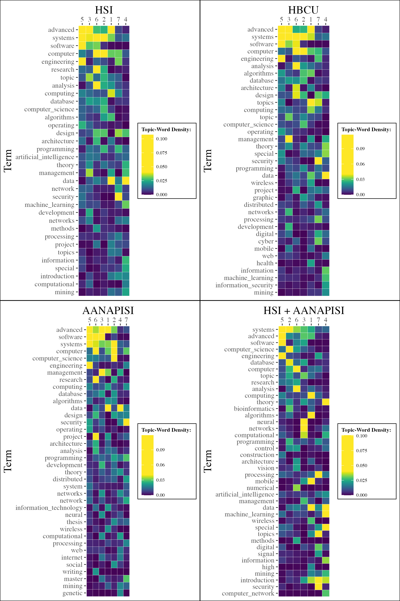
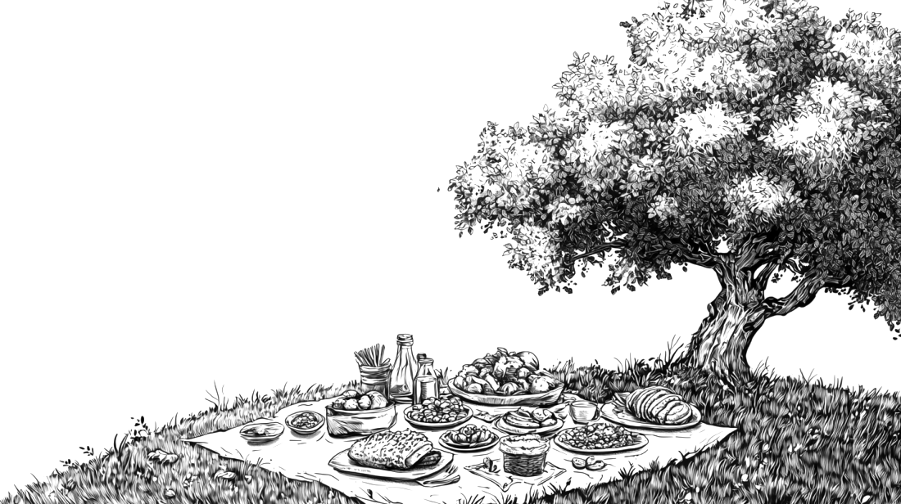

```{r setup, include=FALSE}
usethis::use_git_ignore(c("*.csv", "*.rds"))
options(htmltools.dir.version = FALSE)

library(knitr)
library(tidyverse)
library(xaringan)
library(fontawesome)
```

class: inverse, center, middle

# `r fa("fas fa-images", fill = "#fff")` <br><br> [bretsw.com/aect24-curricular](https://bretsw.com/aect24-curricular)


---

class: inverse, center, middle

# `r fa("fas fa-layer-group", fill = "#fff")` <br><br> Background

---

# `r fa("fas fa-layer-group", fill = "#fff")` Problem

```{r, out.width = "600px", echo = FALSE, fig.align = "center"}

```

### Persistent disparities in computing:

--

- Recent jobs growth in computer science and technology

--

- But racial and ethnic disparities remain, from computing-related graduate degrees to computing-related jobs

---

# `r fa("fas fa-layer-group", fill = "#fff")` Shaping Reality

```{r, out.width = "600px", echo = FALSE, fig.align = "center"}
include_graphics("img/food.png")
```

### Options presented to students shape their perception of reality 

--

Computing programs and courses offered `r fa("fas fa-arrow-right", fill = "#782F40")` perceptions of computing jobs available

---

# `r fa("fas fa-layer-group", fill = "#fff")` Shaping Reality

```{r, out.width = "600px", echo = FALSE, fig.align = "center"}
include_graphics("img/food.png")
```

### Curricular Knowledge:

--

Represented by the terminology used in program names and course titles

---

# `r fa("fas fa-layer-group", fill = "#fff")` Context

```{r, out.width = "600px", echo = FALSE, fig.align = "center"}
include_graphics("img/food.png")
```

### Minority-Serving Institutions (MSIs):

--

Spaces for minoritized students created by U.S. federal funding programs

---

# `r fa("fas fa-layer-group", fill = "#fff")` Purpose

```{r, out.width = "600px", echo = FALSE, fig.align = "center"}
include_graphics("img/food.png")
```

**Step One:** Understand how terminology used in MSI computing programs may support or inhibit students’ workforce opportunities

--

**Step Two:** Evaluate gaps between terminology established in grad school and terminology employers are looking for

---

# `r fa("fas fa-layer-group", fill = "#fff")` Research Questions

```{r, out.width = "600px", echo = FALSE, fig.align = "center"}
include_graphics("img/food.png")
```

- **RQ1:** What terminology do MSIs use to describe computing-related graduate-level programs and courses?

--

- **RQ2:** How does the terminology used by MSIs to describe computing courses vary by degree level?

--

- **RQ3:** How does the terminology used by MSIs to describe computing courses vary by institution type?


---

class: inverse, center, middle

# `r fa("fas fa-map", fill = "#fff")` <br><br> Method

---

# `r fa("fas fa-carrot", fill = "#fff")` Data Collection

```{r, out.width = "720px", echo = FALSE, fig.align = "center"}

```

--

- Identified MSIs with a graduate computing-related department (*n* = 79)

--

- Looked at department websites and online course catalogs

---

# `r fa("fas fa-carrot", fill = "#fff")` Data Collection

```{r, out.width = "100%", echo = FALSE, fig.align = "center"}

```

---

# `r fa("fas fa-carrot", fill = "#fff")` Data Collection

|                     | Programs | Courses |
|---------------------|----------|---------|
| **Overall**         | 173      | 5,776   |
| **Degree Level**    |          |         |
|   Masters           | 133      | 4,299   |
|   PhD               | 24       | 1,362   |
|   Certificate       | 16       | 115     |
| **MSI Type**        |          |         |
|   HSI               | 104      | 3,729   |
|   HBCU              | 40       | 1,001   |
|   AANAPISI          | 17       | 579     |
|   HSI + AANAPISI    | 12       | 467     |

--

<hr>

**Important note:** The idiosyncratic nature of university websites limits full-automated web scraping


---

# `r fa("fas fa-utensils", fill = "#fff")` Data Analysis

```{r, out.width = "600px", echo = FALSE, fig.align = "center"}

```

--

- Natural language processing (NLP) techniques in R to computationally analyze the large amount of text data

--

- **RQ1:** *quanteda* R package (Benoit et al., 2018) to create word clouds

--

- **RQ2 + RQ3:** *topicmodels* R package (Grün & Hornik, 2011) to implement a latent Dirichlet allocation (LDA) approach to identify clusters of terms that frequently appear together


---

class: inverse, center, middle

# `r fa("fas fa-cubes", fill = "#fff")` <br><br> Results

---

# `r fa("fas fa-cubes", fill = "#fff")` RQ1

### Top Terms Used in MSI Graduate Computing Programs 

```{r, out.width = "520px", echo = FALSE, fig.align = "center"}

```

---

# `r fa("fas fa-cubes", fill = "#fff")` RQ1

### Top Terms Used in MSI Graduate Computing Course Titles

```{r, out.width = "520px", echo = FALSE, fig.align = "center"}

```


---

# `r fa("fas fa-cubes", fill = "#fff")` RQ2

### Comparison of MSI Graduate Computing Course Titles by Degree Level

```{r, out.width = "320px", echo = FALSE, fig.align = "center"}

```

---

# `r fa("fas fa-cubes", fill = "#fff")` RQ2

### Comparison of MSI Graduate Computing Course Titles by Degree Level

- Master’s and Ph.D. courses were fairly similar

--

- Master’s courses have slightly more emphasis on `advanced` and Ph.D. slightly more on `software`

--

- More variation when comparing graduate certificate course titles: more emphasis on `architecture`, `visualization`, `high performance`, `biometrics`, and a cluster of `independent`, `data`, and `design`.


---

# `r fa("fas fa-cubes", fill = "#fff")` RQ3

### Comparison of MSI Graduate Computing Course Titles by Degree Level

```{r, out.width = "320px", echo = FALSE, fig.align = "center"}

```

---

# `r fa("fas fa-cubes", fill = "#fff")` RQ3

### Comparison of MSI Graduate Computing Course Titles by Degree Level

- Many similarities across all institutions

--

- HSIs and HSI + AANAPISIs emphasized `artificial intelligence` a bit more

--

- HBCUs emphasized `management`, `cyber`, and `information security` 

--


- AANAPISIs are distinguished by `information technology`, `project`, and `writing`. 

--

- HSI + AANAPISIs emphasized on `machine learning`, `neural`, `networks`, `mobile`, `bioinformatics`, and `computer network`


---

class: inverse, center, middle

# `r fa("fas fa-comments", fill = "#fff")` <br><br> Reflection & Discussion

---

# `r fa("fas fa-layer-group", fill = "#fff")` Implications for Policy

```{r, out.width = "600px", echo = FALSE, fig.align = "center"}

```

### Curricular knowledge is shaped by contextual factors

--

If MSIs are a mechanism to redress racial/ethnic disparities in computing

--

then a first step is to foster inter-institutional synergy through computing program alignment

---

# `r fa("fas fa-layer-group", fill = "#fff")` Implications for Practice

```{r, out.width = "600px", echo = FALSE, fig.align = "center"}

```

### In AECT's next 100 years...  

--

designing and supporting curricular knowledge

--

must take contextual factors into account (e.g., degree level, institution type)

---

# `r fa("fas fa-rocket", fill = "#fff")` Future Work

```{r, out.width = "600px", echo = FALSE, fig.align = "center"}

```

### Next Steps:

--

Follow up to ask “Why?” these observed differences occurred

--

Follow up to compare terminology in curricular knowledge to terminology in computing job postings


---

class: inverse, center, middle

# `r fa("fas fa-question", fill = "#fff")` <br><br> Questions

<br><br>

**Bret Staudt Willet + Annie Wofford + Lara Perez-Felkner + Chantra Nhien**

Florida State University

<br><br>
<hr>

`r fa("envelope", fill = "#fff")` [bret.staudtwillet@fsu.edu](mailto:bret.staudtwillet@fsu.edu) | `r fa("globe", fill = "#fff")` [bretsw.com](https://bretsw.com) | `r fa("fab fa-github", fill = "#fff")` [GitHub](https://github.com/bretsw/)

<hr>

<div class="caption">
Images created with Midjourney. Slides made with RMarkdown.
</div>